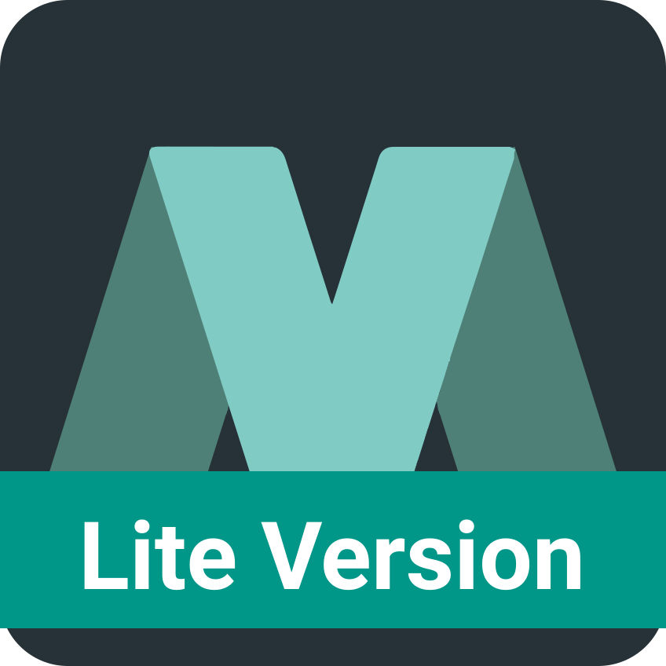

  <a href="https://www.material-theme.com">
</img>
</a>

# Material Theme UI Lite

This is a lite version of the famous [Material Theme UI Plugin](https://plugins.jetbrains.com/plugin/8006-material-theme-ui) which contains only the themes and the color schemes.

If you want to use the icons as well, I invite you to install the [Atom Material Icons](https://plugins.jetbrains.com/plugin/10044-atom-material-icons) plugin.

Plugin page:
https://plugins.jetbrains.com/plugin/12124-material-theme-ui-lite

## Documentation:
https://www.material-theme.com

#### Donate via Paypal:

_@ChrisRM_:

_@Mallowigi_:

#### OpenCollective Backers

<object type="image/svg+xml" data="https://opencollective.com/atom-material-themes-and-plugins/tiers/backer.svg?avatarHeight=36&width=600"></object>

## Development

### Requirements

* JDK 1.8
* IntelliJ IDEA with Gradle

### Developing using IntelliJ Gradle

You can simplify development process thanks to Intellij's **Gradle plugin**. Install the plugin, restart the IDE and you will be prompted with a window asking if you want to import the project as a Gradle project. After that IntelliJ will download the Gradle Wrapper and the tasks will appear in the Gradle Tool Panel on the right.

Import the project from the `build.gradle` file and develop as normal.  Make sure you select JDK 8 in the import wizard.  The other defaults are fine.  You can run the above mentioned CLI Gradle tasks directly in the "Gradle" Tool Window, which expands from the right side of the screen.  To debug, find "runIde" in the list, right-click it, and choose Run/Debug.

--------------------

# Authors:
 
Twitter: [@crmag](https://twitter.com/crmag)
[@mallowigi](https://twitter.com/mallowigi)

Official page: [@MJetbrains](https://twitter.com/MJetbrains)

Github: [@ChrisRM](https://github.com/chrisrm) [@Mallowigi](https://github.com/mallowigi)

Blog: https://www.material-theme.com/docs/blog/

**Thanks to [@equinusocio](https://github.com/equinusocio) and his original [Material Theme](https://github.com/equinusocio/vsc-material-theme) for the inspiration.**

# Contact
You can contact us or ask questions via [Gitter](https://gitter.im/Material-Theme-Jetbrains/Lobby#) or our brand new
[Slack community!](https://join.slack.com/t/material-theme-ui/shared_invite/enQtMzgzNTUxMjQ2MTQ1LWU3Y2ZlYTBlNDEyZmU5YTMzNjAxZjc0NmVkMTk1NzdmNDI1NDAwMzI4NWYxZjVmYzUyYTgwZWEzNjE2YTg2NTA)

Come say hello!

## Other portings

The Material Theme has been ported to many other editors, applications, websites and other platforms:
- [Visual Studio Code](https://github.com/equinusocio/vsc-material-theme/) (by [@equinusocio](https://github.com/equinusocio)
- [Sublime Text](https://github.com/equinusocio/material-theme/) (also by [@equinusocio](https://github.com/equinusocio)
- [Hyper](https://github.com/equinusocio/hyper-material-theme) (also by [@equinusocio](https://github.com/equinusocio).
- [Atom](https://github.com/silvestreh/atom-material-ui) (by [@silvestreh](https://github.com/silvestreh))
- [Vim](https://github.com/kristijanhusak/vim-hybrid-material) (by [@kristijanhusak](https://github.com/kristijanhusak)).
- [Terminal OSX](https://gist.github.com/mvaneijgen/4c56701215847dd5ddcf) (by [@mvaneijgen](https://github.com/mvaneijgen)).
- [iTerm2](https://gist.github.com/Revod/3f3115f8d4b90fc986fd4b61441c2567) (by [@Revod](https://github.com/Revod)) and [iTerm2 Palenight](https://github.com/JonathanSpeek/palenight-iterm2) (by [@jonathanspeek](https://github.com/jonathanspeek)).
- [ConEmu](https://gist.github.com/rajadain/b306b2ba71bd58a1df41) (by [@rajadain](https://github.com/rajadain)).
- [Slack](https://slack.com/) (`#263238`, `#2E3A40`, `#80CBC4`, `#FFFFFF`, `#13191C`, `#FFFFFF`, `#50FA7B`, `#FF5555`)
- [Nylas N1](https://github.com/jackiehluo/n1-material) (thanks to [@jackiehluo](https://github.com/jackiehluo))
- [Base16](https://github.com/ntpeters/base16-materialtheme-scheme) (by [@ntpeters](https://github.com/ntpeters))
- [Notepad++](https://github.com/Codextor/npp-material-theme) (by [@Codextor](https://github.com/Codextor))
- [Chrome Devtools](https://chrome.google.com/webstore/detail/material-devtools-theme/pmlofkkoaahmkmmebdkkcljmflocijlo) (by [@jaysuz](https://github.com/jaysuz/material-dev-tools))
- [Bear](https://github.com/r3volution11/material-theme-bear-notes) (by [Doug C. Hardester](https://github.com/r3volution11))

## Other Projects

Check out my other projects:
- [Material Theme UI](https://plugins.jetbrains.com/plugin/8006-material-theme-ui) - A lot of features to completely customize the IDE! With theme switching, custom themes, icons, layout settings and more.
- [Image Icon Plugin](https://plugins.jetbrains.com/plugin/11096-image-icon-viewer) - A previewer for small images and svgs directly in the Project View
- [Atom Material Icons](https://plugins.jetbrains.com/plugin/10044-atom-material-icons) - A mix of the Atom File Icons and the Material Icons, or if you prefer, the Icons component of this plugin :)
- [Slack One Dark Theme](https://github.com/mallowigi/slack-one-dark-theme) - A One Dark theme for Slack
- [Custom Syntax Highlighter](https://github.com/mallowigi/Custom-Syntax-Highlighter) - Proof of concept for defining custom keywords highlighting.

## Contributors

This project exists thanks to all the people who contribute. 

## Backers

Thank you to all our backers! 🙏 [[Become a backer](https://opencollective.com/atom-material-themes-and-plugins#backer)]

Check also : http://www.material-theme.com/docs/support-us/

## Sponsors

Support this project by becoming a sponsor. Your logo will show up here with a link to your website. [[Become a sponsor](https://opencollective.com/atom-material-themes-and-plugins#sponsor)]

