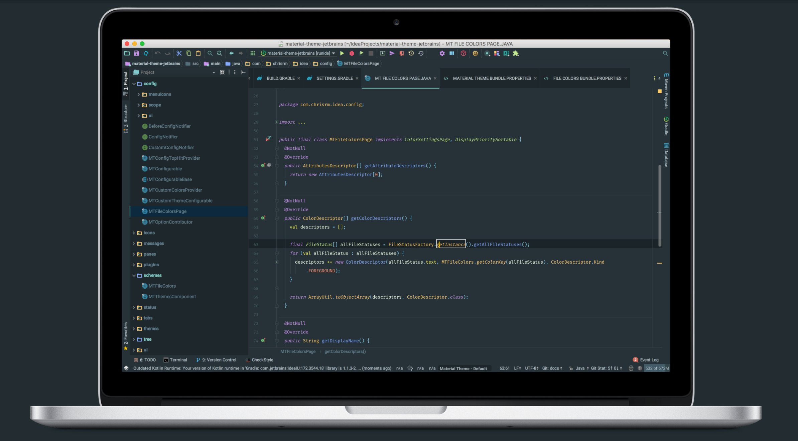

# Material Theme UI Lite for JetBrains

  <a href="https://www.material-theme.com">
</img>
</a>

This is a lite version of the famous [Material Theme UI Plugin](https://plugins.jetbrains.com/plugin/8006-material-theme-ui) which contains only the themes and the color schemes.

If you want to use the icons as well, I invite you to install the [Atom Material Icons](https://plugins.jetbrains.com/plugin/10044-atom-material-icons) plugin.

<!-- ALL-CONTRIBUTORS-BADGE:START - Do not remove or modify this section -->

<!-- ALL-CONTRIBUTORS-BADGE:END -->

Plugin page:
<https://plugins.jetbrains.com/plugin/12124-material-theme-ui-lite>

## Documentation:
<https://www.material-theme.com>

#### Donate via Paypal:

_@Mallowigi_:

#### OpenCollective Backers

<object type="image/svg+xml" data="https://opencollective.com/atom-material-themes-and-plugins/tiers/backer.svg?avatarHeight=36&width=600"></object>

--------------------

# Authors:
 
Twitter: [@crmag](https://twitter.com/crmag)
[@mallowigi](https://twitter.com/mallowigi)

Official page: [@AtomMaterialUI](https://twitter.com/AtomMaterialUI)

Github: [@ChrisRM](https://github.com/chrisrm) [@Mallowigi](https://github.com/mallowigi)

**Thanks to [@equinusocio](https://github.com/equinusocio) and his original [Material Theme](https://github.com/equinusocio/vsc-material-theme) for the inspiration.**

# Contact
You can contact us or ask questions in our [Slack community!](https://join.slack.com/t/material-theme-ui/shared_invite/enQtMzgzNTUxMjQ2MTQ1LWU3Y2ZlYTBlNDEyZmU5YTMzNjAxZjc0NmVkMTk1NzdmNDI1NDAwMzI4NWYxZjVmYzUyYTgwZWEzNjE2YTg2NTA)

Come say hello!

## Other portings

The Material Theme has been ported to many other editors, applications, websites and other platforms:

- [Visual Studio Code](https://github.com/equinusocio/vsc-material-theme/) (by [@equinusocio](https://github.com/equinusocio)
- [Sublime Text](https://github.com/equinusocio/material-theme/) (also by [@equinusocio](https://github.com/equinusocio)
- [Hyper](https://github.com/equinusocio/hyper-material-theme) (also by [@equinusocio](https://github.com/equinusocio).
- [Atom](https://github.com/silvestreh/atom-material-ui) (by [@silvestreh](https://github.com/silvestreh))
- [Vim](https://github.com/kristijanhusak/vim-hybrid-material) (by [@kristijanhusak](https://github.com/kristijanhusak)).
- [Terminal OSX](https://gist.github.com/mvaneijgen/4c56701215847dd5ddcf) (by [@mvaneijgen](https://github.com/mvaneijgen)).
- [iTerm2](https://gist.github.com/Revod/3f3115f8d4b90fc986fd4b61441c2567) (by [@Revod](https://github.com/Revod)) and [iTerm2 Palenight](https://github.com/JonathanSpeek/palenight-iterm2) (by [@jonathanspeek](https://github.com/jonathanspeek)).
- [ConEmu](https://gist.github.com/rajadain/b306b2ba71bd58a1df41) (by [@rajadain](https://github.com/rajadain)).
- [Slack Sidebar](https://slack.com/) (`#263238`, `#2E3A40`, `#80CBC4`, `#FFFFFF`, `#13191C`, `#FFFFFF`, `#50FA7B`, `#FF5555`)
- [Nylas N1](https://github.com/jackiehluo/n1-material) (thanks to [@jackiehluo](https://github.com/jackiehluo))
- [Base16](https://github.com/ntpeters/base16-materialtheme-scheme) (by [@ntpeters](https://github.com/ntpeters))
- [Notepad++](https://github.com/Codextor/npp-material-theme) (by [@Codextor](https://github.com/Codextor))
- [Chrome Devtools](https://chrome.google.com/webstore/detail/material-devtools-theme-c/jmefikbdhgocdjeejjnnepgnfkkbpgjo)
- [Bear](https://github.com/r3volution11/material-theme-bear-notes) (by [Doug C. Hardester](https://github.com/r3volution11))
- [Slack Themes](https://github.com/mallowigi/slack-themes) - Porting of the Material Theme to Slack
- [Gmail](https://userstyles.org/styles/174257/material-dark-gmail) (by [@Charlie Etienne](https://github.com/CharlieEtienne))
- [Google Calendar](https://userstyles.org/styles/174228/material-dark-google-calendar) (by [@Charlie Etienne](https://github.com/CharlieEtienne))
- [Google Keep](https://userstyles.org/styles/174291/material-dark-google-keep) (by [@Charlie Etienne](https://github.com/CharlieEtienne))
- [Trello](https://userstyles.org/styles/167605/material-dark-trello) (by [@Charlie Etienne](https://github.com/CharlieEtienne))
- [GitHub](https://github.com/CharlieEtienne/material-github) (by [@Charlie Etienne](https://github.com/CharlieEtienne))
- [Google](https://github.com/CharlieEtienne/material-google) (by [@Charlie Etienne](https://github.com/CharlieEtienne))

## Other Projects

Check out my other projects:
- [Material Theme UI](https://plugins.jetbrains.com/plugin/8006-material-theme-ui) - A lot of features to completely customize the IDE! With theme switching, custom themes, icons, layout settings and more.
- [Image Icon Plugin](https://plugins.jetbrains.com/plugin/11096-image-icon-viewer) — A previewer for small images and svg directly in the Project View
- [Atom Material Icons](https://plugins.jetbrains.com/plugin/10044-atom-material-icons) — A mix of the Atom File Icons and the Material Icons, or if you prefer, the Icons component of this plugin :)
- [Custom Syntax Highlighter](https://github.com/mallowigi/Custom-Syntax-Highlighter) — Proof of concept for defining custom keywords highlighting.
- [Material Theme UI for Chrome](https://chrome.google.com/webstore/detail/material-devtools-theme-c/jmefikbdhgocdjeejjnnepgnfkkbpgjo) — Porting of the Material Theme for Chrome
- [Slack Themes](https://github.com/mallowigi/slack-themes) — Porting of the Material Theme to Slack

## Contributors

This project exists thanks to all the people who contribute. 
<!-- ALL-CONTRIBUTORS-LIST:START — Do not remove or modify this section -->
<!-- prettier-ignore-start -->
<!-- markdownlint-disable -->
<table>
  <tr>
    <td align="center"><a href="https://unthrottled.io"> <b>Alex Simons</b></a> <a href="https://github.com/mallowigi/material-theme-jetbrains/commits?author=Unthrottled" title="Code">💻</a> <a href="#infra-Unthrottled" title="Infrastructure (Hosting, Build-Tools, etc)">🚇</a></td>
    <td align="center"><a href="https://kotlin.desarrollador-android.com/"> <b>Javier Segovia Cordoba</b></a> <a href="https://github.com/mallowigi/material-theme-jetbrains/commits?author=JavierSegoviaCordoba" title="Code">💻</a> <a href="#infra-JavierSegoviaCordoba" title="Infrastructure (Hosting, Build-Tools, etc)">🚇</a></td>
  </tr>
</table>

<!-- markdownlint-restore -->
<!-- prettier-ignore-end -->

<!-- ALL-CONTRIBUTORS-LIST:END -->

## Backers

Thank you to all our backers! 🙏 [[Become a backer](https://opencollective.com/atom-material-themes-and-plugins#backer)]

Check also : <https://www.material-theme.com/docs/support-us/>

## Sponsors

Support this project by becoming a sponsor. Your logo will show up here with a link to your website. [[Become a sponsor](https://opencollective.com/atom-material-themes-and-plugins#sponsor)]

